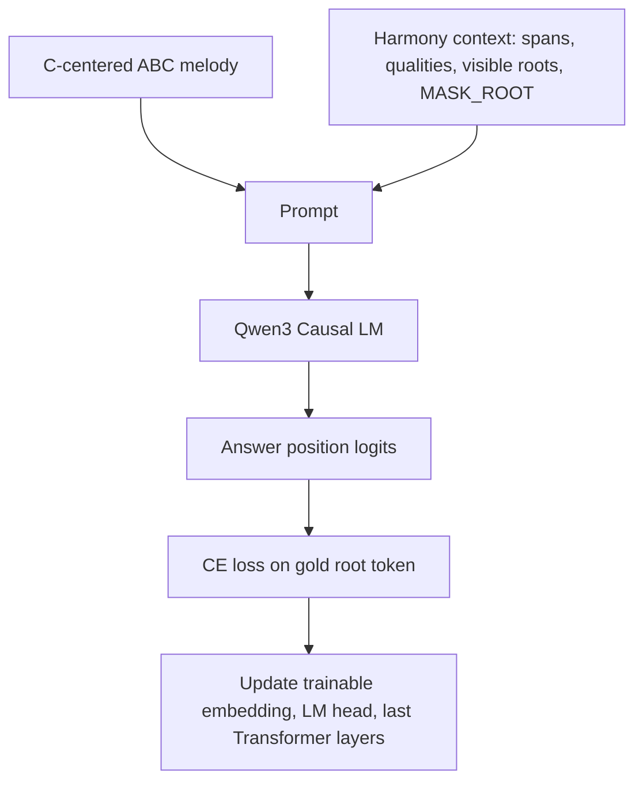
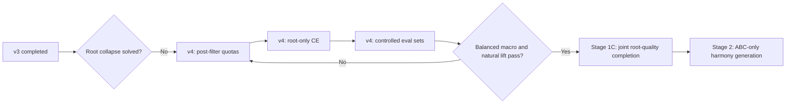

# Stage 1A v3 Root Completion 实验报告

生成时间：2026-08-05  
阶段：Stage 1A, Root Masked Completion  
实验版本：v3  
远程输出目录：`/root/autodl-tmp/jazzarranger/outputs/stage1a-v3-root-20260805_154720`

## 1. 摘要结论

Stage 1A 的当前任务是：在 C-centered ABC melody、gold span 边界、visible quality 和部分 visible root context 已知的条件下，预测被遮蔽 span 的 root token。

v3 的主要变化是把训练从 v2 的短 smoke test 扩大到更正式的 root-balanced 训练：

| 项目 | v2 | v3 |
|---|---:|---:|
| optimizer updates | 400 | 1000 |
| root-loss positions | 4800 | 12000 |
| 每个 root 的有效监督次数 | 400 | 1000 |
| balanced eval 规模 | 288 | 2398 |
| natural eval 规模 | 768，且早期抽样有偏 | 4302，已 shuffle |

v3 的结论不是“训练链路坏了”，而是：

1. 模型已经摆脱了纯 all-C collapse，balanced accuracy 明显高于 $1/12$ 的随机基线。
2. 但当前 recipe 仍然明显偏向 `<R_C>`，并且 natural accuracy 只比 always-C baseline 略高。
3. 继续原样把 v3 跑到 2000 或 5000 updates 不够稳，应该先进入 v4 修正 sampling、mask quota、visible context shortcut 和 root-only loss 设计。

核心数字：

| 评估集 | Root Acc | Macro Acc | Top-3 Acc | Gold `<R_C>` Share | Pred `<R_C>` Share | 结论 |
|---|---:|---:|---:|---:|---:|---|
| Balanced validation | 17.06% | 17.05% | 46.04% | 8.34% | 33.61% | 高于随机，但仍强烈偏 C。 |
| Natural validation | 22.43% | 15.05% | 61.09% | 21.57% | 44.75% | 仅略高于 always-C baseline。 |

Natural validation 的 always-C baseline 约为：

```math
\mathrm{Acc}_{\mathrm{alwaysC}}
=
\frac{N_{R_C}}{N}
=
21.57\%
```

而 v3 natural root accuracy 为 $22.43\%$，净提升只有约 $0.86$ 个百分点。因此 Stage 2 的 ABC-only full harmony generation 仍应暂停，先解决 Stage 1A 的 root 判别稳定性。

## 2. 当前训练目标

Stage 1A 不训练完整和声序列生成，也不训练 quality、boundary、note role 或 preference。它只训练一个窄任务：

```text
ABC melody + masked harmony context -> masked root token
```

样本格式如下：

```text
<MELODY>
... C-centered ABC melody ...
</MELODY>

<HARMONY_CONTEXT>
<SPAN> @0-4  <R_D>       <Q_MIN7> </SPAN>
<SPAN> @4-8  <MASK_ROOT> <Q_DOM7> </SPAN>
<SPAN> @8-12 <R_C>       <Q_MAJ7> </SPAN>
</HARMONY_CONTEXT>

<ROOT_PREDICTION>
<R_G>
</ROOT_PREDICTION>
```

模型需要从以下信息中恢复被遮蔽 root：

| 信息来源 | 是否可见 | 作用 |
|---|---:|---|
| ABC melody | 是 | 提供音高、拍位、时值、小节结构。 |
| span start/end | 是 | 告诉模型目标和弦覆盖的时间范围。 |
| quality | 是 | 例如 `<Q_DOM7>`、`<Q_MIN7>`，辅助约束 root。 |
| 邻近 visible root | 部分可见 | 提供局部进行 context。 |
| target root | 否 | 只在答案区间出现并计 loss。 |

Stage 1A 的目的不是最终部署，而是短 curriculum：先确认模型可以学到 root 与 melody、quality、span、局部进行之间的关系，再进入 Stage 1C 和 Stage 2。

## 3. 数据与表示状态

当前处理后的主训练数据已经 C-centered。也就是说 melody 和 chord root 是同步规约的，不存在“只规约 chord、melody 仍在原调”的问题。

规约公式为：若原调 tonic 的 pitch-class index 为 $k$，规约到 C 的平移量为：

```math
\tau = -k \pmod{12}
```

对 melody pitch $p$ 和 chord root pitch-class $r$，同步平移：

```math
p' = p + \tau
```

```math
r' = (r + \tau) \bmod 12
```

span 边界与 quality 不变。

已验证的数据规约状态：

| 检查项 | 数值 | 含义 |
|---|---:|---|
| processed rows | 2075 | 当前处理后样本总数。 |
| nonzero transpose rows | 1638 | 大多数样本确实发生过非零移调。 |
| same ABC when nonzero | 0 | 非零移调样本的 ABC 没有保持原样，说明 melody 同步变了。 |
| bad key | 0 | 规约后的 key 没有异常。 |
| bad chord transpose | 0 | chord root 平移校验通过。 |
| harmony token parse errors | 0 | 主目标 token 可解析。 |

数据集权重与当前用途：

| Dataset | 处理后样本数 | 权重 | 当前用途 |
|---|---:|---:|---|
| EMOPIA+ | 879 | 1.0 | 主训练源。 |
| HLSD | 11 | 1.0 | 高权重但数量很小。 |
| POP909 | 1085 | 0.7 | 大规模但有噪声，降权使用。 |
| OpenBook | 100 | 0.0 | 暂不进训练，仅审计保留。 |

当前 key 分布：

| Key | 数量 |
|---|---:|
| C:maj | 1323 |
| C:min | 752 |

## 4. 训练方法

### 4.1 Causal LM 训练形式

Stage 1A 仍使用 Qwen3-Coder-1.7B 作为 causal LM。训练输入拼接为：

```text
prompt_ids + answer_ids + eos
```

label mask：

```text
prompt labels: -100
answer labels: answer token ids
padding labels: -100
```

因此 ABC、harmony context、wrapper token 都不直接计 loss。loss 只落在 `<ROOT_PREDICTION>` 中的 root answer token。

训练流程图：



### 4.2 Root loss

设：

- $X_b$：第 $b$ 个样本的 ABC melody；
- $B_b$：gold span 边界；
- $Q_b$：visible quality；
- $R_{b,\neg i}$：未遮挡 root context；
- $\mathcal{M}_b$：第 $b$ 个样本中被遮挡的 root 位置；
- $r_{b,i}$：第 $i$ 个被遮挡位置的 gold root。

Stage 1A 的目标为：

```math
\begin{aligned}
\mathcal{L}_{R}
&=
-\frac{1}{B}
\sum_{b=1}^{B}
\frac{1}{|\mathcal{M}_b|}
\sum_{i\in\mathcal{M}_b}
\log p_{\theta}\left(
r_{b,i}
\mid
X_b,B_b,Q_b,R_{b,\neg i}
\right)
\end{aligned}
```

v3 的工程实现中，每个 training example 只预测一个 answer root，因此通常有：

```math
|\mathcal{M}_b| = 1
```

这意味着 v3 的有效监督量应按 root answer positions 计算，而不是按总 token 数或 task bank 行数计算。

### 4.3 不使用 LoRA

当前实验不使用 LoRA、adapter、prefix tuning，也不新增分类 head。原因是此阶段需要让模型学习新的结构化输出语言以及 ABC-to-harmony 的关系，只更新低秩 adapter 可能不足。

v3 采用部分参数训练：

| 模块 | v3 策略 |
|---|---|
| 新增 root / quality / mask token embedding | 训练 |
| 对应 LM head 行 | 训练 |
| 原始 token embedding | 冻结或极低学习率 |
| Transformer 前层 | 冻结约 50% |
| Transformer 后层 | 训练约 50% |
| Final norm | 训练 |
| LoRA / adapter | 不使用 |

## 5. v3 抽样方法

### 5.1 为什么从 v2 改到 v3

v2 的有效监督规模太小：

```math
400 \times 12 = 4800
```

也就是 400 个 optimizer updates，每个 update 有 12 个 root target，总计 4800 个 root target。

每个 root 只有：

```math
\frac{4800}{12} = 400
```

次明确梯度。这个规模足以验证 token、loss、label shift、梯度和模型表达能力可以工作，但不足以让 1.7B 模型泛化出稳定 root 判别。

v3 将有效监督扩到：

```math
1000 \times 12 = 12000
```

也就是 1000 个 optimizer updates，每个 update 有 12 个 root target，总计 12000 个 root target。

每个 root：

```math
\frac{12000}{12} = 1000
```

次监督。

### 5.2 Task-level root-balanced sampler

v3 的采样单位不是一首歌，也不是一个 jsonl row，而是一个 masked-root task。每个 task 大致包含：

```json
{
  "song_id": "...",
  "mask_span_id": 3,
  "target_root": "<R_G>",
  "quality": "<Q_DOM7>",
  "mask_type": "cadential_center",
  "input": "... <MASK_ROOT> ...",
  "answer": "<R_G>"
}
```

每个 optimizer update 尽量采样：

```text
12 个 root 各 1 条 task
```

因此训练 label 层面是严格均衡的。

### 5.3 v3 的新增多样性约束

v3 相比 v2 还加入了以下工程改动：

| 改动 | 目的 |
|---|---|
| `task_song_id` | 记录 task 来源歌曲，减少同一歌曲重复支配训练。 |
| `task_key` | 保留 key 信息，支持后续按 key/mode 诊断。 |
| `_choose_diverse_task` | 在同 root 候选中尽量增加 song、dataset、quality、mask type 多样性。 |
| natural eval shuffle | 避免 natural eval 只取到前若干 dataset 或单一 mask type。 |
| overlength bad-task cache | 避免反复 tokenize 过长 task。 |
| root-only metric eval | 评估时只在 answer position 比较 12 个 root logits，提高评估速度和准确性。 |

### 5.4 v3 实际训练样本分布

v3 训练实际使用：

| 项目 | 数值 |
|---|---:|
| training examples | 12000 |
| answer roots | 12000 |
| unique rows | 1499 |
| max examples per row | 289 |
| skipped over max length | 19475 |
| skipped zero weight | 75 |

Root label 完全均衡：

| Root | Count |
|---|---:|
| `<R_C>` | 1000 |
| `<R_Db>` | 1000 |
| `<R_D>` | 1000 |
| `<R_Eb>` | 1000 |
| `<R_E>` | 1000 |
| `<R_F>` | 1000 |
| `<R_Gb>` | 1000 |
| `<R_G>` | 1000 |
| `<R_Ab>` | 1000 |
| `<R_A>` | 1000 |
| `<R_Bb>` | 1000 |
| `<R_B>` | 1000 |

Dataset 分布：

| Dataset | Count | Share |
|---|---:|---:|
| EMOPIA+ | 5256 | 43.80% |
| HLSD | 1471 | 12.26% |
| POP909 | 5273 | 43.94% |

Quality 分布：

| Quality | Count |
|---|---:|
| aug | 939 |
| dim | 1049 |
| dom7 | 1249 |
| hdim7 | 912 |
| maj | 1410 |
| maj7 | 1267 |
| min | 1379 |
| min7 | 1262 |
| sus2 | 1281 |
| sus4 | 1252 |

Transpose shift 也基本均衡：

| Shift | Count | Shift | Count |
|---:|---:|---:|---:|
| 0 | 1013 | 6 | 1012 |
| 1 | 978 | 7 | 967 |
| 2 | 1003 | 8 | 986 |
| 3 | 1039 | 9 | 1005 |
| 4 | 1015 | 10 | 991 |
| 5 | 998 | 11 | 993 |

## 6. Mask 设计与实际偏移

v3 原定 mask recipe：

| Mask 类型 | 目标占比 | 目的 |
|---|---:|---|
| `single_internal` | 45% | 最基础的单 root recovery。 |
| `cadential_center` | 20% | 在真实 cadence / 251-like context 中学习局部进行。 |
| `adjacent_double` | 20% | 减少只抄相邻 root 的 shortcut。 |
| `long_context_sparse` | 15% | 学较长上下文中的稀疏 root 恢复。 |

但过长样本过滤后，实际训练分布变成：

| Mask 类型 | Count | 实际占比 | 目标占比 | 偏移 |
|---|---:|---:|---:|---:|
| `single_internal` | 5023 | 41.86% | 45% | -3.14 pp |
| `cadential_center` | 4796 | 39.97% | 20% | +19.97 pp |
| `adjacent_double` | 1251 | 10.43% | 20% | -9.57 pp |
| `long_context_sparse` | 930 | 7.75% | 15% | -7.25 pp |

balanced eval 的 mask 分布也出现类似偏移：

| Mask 类型 | Balanced eval 占比 |
|---|---:|
| `single_internal` | 48.8% |
| `cadential_center` | 40.4% |
| `adjacent_double` | 5.8% |
| `long_context_sparse` | 5.0% |

这很关键：v3 虽然 root label 均衡，但 surviving tasks 的 context 并不均衡。`cadential_center` 被严重放大，容易强化 `<R_C>`、`<R_G>`、`<R_F>` 等 C-centered 语境中的低成本答案。

## 7. 训练配置

v3 主要训练配置如下：

| 配置项 | 值 |
|---|---|
| base model | Qwen3-Coder-1.7B-Base |
| model path | `/root/autodl-tmp/models/qwen3-1.7b-base` |
| output dir | `/root/autodl-tmp/jazzarranger/outputs/stage1a-v3-root-20260805_154720` |
| updates per epoch | 1000 |
| examples per root per update | 1 |
| gradient accumulation steps | 12 |
| root-loss positions | 12000 |
| max length | 4096 |
| train last ratio | 0.50 |
| learning rate | $2\times 10^{-5}$ |
| token learning rate | $1\times 10^{-4}$ |
| precision | bf16 |
| gradient checkpointing | enabled |
| LoRA | disabled |

训练中 internal eval loss：

| Step | Eval Loss |
|---:|---:|
| 500 | 2.266 |
| 1000 | 2.203 |

这个 loss 下降说明训练在优化目标上有进展，但 root accuracy 与预测分布显示它仍在学习偏置解。

## 8. 评估方法

v3 使用两套 validation：

| 评估集 | 目的 | 当前规模 |
|---|---|---:|
| Balanced validation | 每个 root 尽量等量，专门诊断少数 root 是否学会。 | 2398 root positions |
| Natural validation | 保留真实分布，衡量实际任务场景。 | 4302 root positions |

主要指标定义如下。

Micro accuracy：

```math
\mathrm{Acc}_{\mathrm{micro}}
=
\frac{1}{N}
\sum_{i=1}^{N}
\mathbf{1}\left[\hat r_i = r_i\right]
```

Macro accuracy：

```math
\begin{aligned}
\mathrm{Acc}_{\mathrm{macro}}
&=
\frac{1}{|\mathcal{R}|}
\sum_{r\in\mathcal{R}}
\frac{
\sum_{i=1}^{N}
\mathbf{1}\left[r_i=r\right]
\mathbf{1}\left[\hat r_i=r_i\right]
}{
\sum_{i=1}^{N}
\mathbf{1}\left[r_i=r\right]
}
\end{aligned}
```

Top-3 accuracy：

```math
\begin{aligned}
\mathrm{Acc}_{\mathrm{top3}}
&=
\frac{1}{N}
\sum_{i=1}^{N}
\mathbf{1}\left[
r_i
\in
\mathrm{Top3}\left(p_{\theta}(\cdot \mid x_i)\right)
\right]
\end{aligned}
```

预测分布熵：

```math
H(\hat R)
=
-\sum_{r\in\mathcal{R}}
\hat p(r)
\log \hat p(r)
```

如果 $H(\hat R)$ 明显低于 gold distribution entropy，且某个 root 的预测 share 远高于 gold share，通常说明模型在坍缩到低成本先验。

## 9. v3 结果

### 9.1 Balanced validation

指标文件：

```text
/root/autodl-tmp/jazzarranger/outputs/stage1a-v3-root-20260805_154720/balanced_val_metrics_200_per_root.json
```

整体指标：

| Metric | Value |
|---|---:|
| examples / root tokens | 2398 |
| root accuracy | 17.06% |
| root macro accuracy | 17.05% |
| root min accuracy | 2.00% |
| root top-3 accuracy | 46.04% |
| gold entropy | 2.4849 |
| pred entropy | 2.0714 |
| gold `<R_C>` share | 8.34% |
| pred `<R_C>` share | 33.61% |

按 root 的 accuracy：

| Root | Accuracy | Root | Accuracy |
|---|---:|---|---:|
| `<R_C>` | 55.00% | `<R_Gb>` | 5.50% |
| `<R_Db>` | 15.00% | `<R_G>` | 36.00% |
| `<R_D>` | 22.50% | `<R_Ab>` | 7.00% |
| `<R_Eb>` | 14.00% | `<R_A>` | 4.52% |
| `<R_E>` | 18.09% | `<R_Bb>` | 12.50% |
| `<R_F>` | 12.50% | `<R_B>` | 2.00% |

按 mask type：

| Mask 类型 | Accuracy |
|---|---:|
| `adjacent_double` | 27.54% |
| `cadential_center` | 20.85% |
| `long_context_sparse` | 19.01% |
| `single_internal` | 12.48% |

按 dataset：

| Dataset | Accuracy |
|---|---:|
| EMOPIA+ | 15.38% |
| POP909 | 18.61% |

Balanced validation 的预测分布：

| Root | Gold Share | Pred Share | Pred Count |
|---|---:|---:|---:|
| `<R_C>` | 8.34% | 33.61% | 806 |
| `<R_G>` | 8.34% | 16.81% | 403 |
| `<R_D>` | 8.34% | 10.63% | 255 |
| `<R_F>` | 8.34% | 10.34% | 248 |
| `<R_Db>` | 8.34% | 5.55% | 133 |
| `<R_Eb>` | 8.34% | 5.13% | 123 |
| `<R_E>` | 8.34% | 4.42% | 106 |
| `<R_A>` | 8.34% | 4.09% | 98 |
| `<R_Gb>` | 8.34% | 2.67% | 64 |
| `<R_Ab>` | 8.34% | 2.63% | 63 |
| `<R_Bb>` | 8.34% | 2.63% | 63 |
| `<R_B>` | 8.34% | 1.50% | 36 |

直观图示：

```text
Balanced pred share
<R_C>  33.61% | #########################
<R_G>  16.81% | #############
<R_D>  10.63% | ########
<R_F>  10.34% | ########
<R_Db>  5.55% | ####
<R_Eb>  5.13% | ####
<R_E>   4.42% | ###
<R_A>   4.09% | ###
<R_Gb>  2.67% | ##
<R_Ab>  2.63% | ##
<R_Bb>  2.63% | ##
<R_B>   1.50% | #
```

### 9.2 Natural validation

指标文件：

```text
/root/autodl-tmp/jazzarranger/outputs/stage1a-v3-root-20260805_154720/natural_val_metrics_5000.json
```

整体指标：

| Metric | Value |
|---|---:|
| examples / root tokens | 4302 |
| root accuracy | 22.43% |
| root macro accuracy | 15.05% |
| root min accuracy | 2.90% |
| root top-3 accuracy | 61.09% |
| gold entropy | 2.2392 |
| pred entropy | 1.7358 |
| gold `<R_C>` share | 21.57% |
| pred `<R_C>` share | 44.75% |

按 root 的 accuracy：

| Root | Accuracy | Gold Count | Pred Count |
|---|---:|---:|---:|
| `<R_C>` | 58.30% | 928 | 1925 |
| `<R_Db>` | 16.13% | 62 | 93 |
| `<R_D>` | 37.17% | 304 | 504 |
| `<R_Eb>` | 4.33% | 254 | 133 |
| `<R_E>` | 2.90% | 241 | 54 |
| `<R_F>` | 12.99% | 585 | 643 |
| `<R_Gb>` | 6.98% | 86 | 65 |
| `<R_G>` | 17.85% | 734 | 605 |
| `<R_Ab>` | 2.90% | 310 | 48 |
| `<R_A>` | 4.26% | 376 | 68 |
| `<R_Bb>` | 12.24% | 335 | 140 |
| `<R_B>` | 4.60% | 87 | 24 |

按 dataset：

| Dataset | Accuracy |
|---|---:|
| EMOPIA+ | 22.98% |
| POP909 | 22.34% |

Natural validation 的 gold / pred root count：

| Root | Gold Count | Pred Count | 变化 |
|---|---:|---:|---:|
| `<R_C>` | 928 | 1925 | +997 |
| `<R_D>` | 304 | 504 | +200 |
| `<R_F>` | 585 | 643 | +58 |
| `<R_G>` | 734 | 605 | -129 |
| `<R_Bb>` | 335 | 140 | -195 |
| `<R_Eb>` | 254 | 133 | -121 |
| `<R_Db>` | 62 | 93 | +31 |
| `<R_A>` | 376 | 68 | -308 |
| `<R_Gb>` | 86 | 65 | -21 |
| `<R_E>` | 241 | 54 | -187 |
| `<R_Ab>` | 310 | 48 | -262 |
| `<R_B>` | 87 | 24 | -63 |

Natural validation 的核心问题是：模型把真实分布中 $21.57\%$ 的 `<R_C>` 放大到 $44.75\%$，同时明显低估 `<R_A>`、`<R_Ab>`、`<R_Bb>`、`<R_E>` 等 root。

## 10. 与 v2 的对比

| 指标 | v2 Balanced | v3 Balanced | 变化 |
|---|---:|---:|---:|
| root accuracy | 14.58% | 17.06% | +2.48 pp |
| macro accuracy | 14.58% | 17.05% | +2.47 pp |
| top-3 accuracy | 50.00% | 46.04% | -3.96 pp |
| pred `<R_C>` share | 22.57% | 33.61% | +11.04 pp |
| min per-root accuracy | 0.00% | 2.00% | +2.00 pp |

解释：

1. v3 的 top-1 有小幅提高，说明更多训练量和更大评估集确实带来了一些学习。
2. 但 top-3 下降，同时 `<R_C>` 预测占比显著升高，说明模型没有稳定学出 12-way root 判别，而是在更强地利用 C-centered 低成本先验。
3. v3 的结果不能简单解释为“训练步数还不够”。如果同 recipe 继续扩大训练，可能会进一步强化 `<R_C>` shortcut。

## 11. 问题现状

当前 Stage 1A v3 的问题可以概括为：

```text
label 层面已经 root-balanced，
但 context 层面、mask survival 层面和优化目标层面仍然不 balanced。
```

更具体地说：

| 问题 | 证据 | 影响 |
|---|---|---|
| `<R_C>` 预测过多 | balanced pred share 33.61%，gold 8.34% | 说明均衡 label 后仍有 tonic attractor。 |
| natural 只略高于 always-C | 22.43% vs 21.57% | 实际任务收益很小。 |
| 预测分布熵低 | balanced pred entropy 2.0714，gold 2.4849 | 模型输出分布过尖，类别覆盖不足。 |
| chromatic / non-tonic root 很弱 | `<R_B>` 2.00%，`<R_A>` 4.52%，`<R_Gb>` 5.50% | 少数 root 仍没有稳定学会。 |
| mask type 被过滤扭曲 | cadence 实际 39.97%，目标 20% | context shortcut 被放大。 |
| sample 多样性仍不足 | 12000 examples 只来自 1499 unique rows，单 row 最多 289 次 | root-balanced 可能仍在反复利用少量相似 context。 |

## 12. 原因分析

### 12.1 不是底层实现 bug

此前单 batch overfit 已经证明：

1. 新增 token 可以被 tokenizer 正确编码。
2. 模型可以在 answer root 位置产生对应 root token。
3. label shift 与 `labels=-100` 的基本链路是通的。
4. 可训练参数确实能收到梯度并降低 loss。
5. C-centered melody 和 chord 是同步规约的。

因此当前问题不应优先按 tokenizer bug、loss 对齐 bug、只规约 chord bug 处理。

### 12.2 Root-balanced label 不等于 root-balanced condition

v3 保证了每个 root 出现 1000 次，但没有保证每个 root 的条件分布一致。

理想上，我们希望：

```math
p(x \mid r)
```

在 dataset、song、quality、mask type、bar position、span duration、visible context 上足够多样。但 v3 实际上只严格控制了：

```math
p(r)
```

这意味着模型仍可能学到：

```text
某些 context 模式 -> 预测 C/G/F/D
```

而不是从 melody-span-quality 的细节中判断 root。

### 12.3 C-centered 表示强化了 tonic shortcut

C-centered 是总体正确的做法，因为它减少跨调重复训练，让模型专注相对结构。但副作用是：所有曲子都落在 C/A minor 空间，`<R_C>`、`<R_F>`、`<R_G>` 变成最常见、最容易利用的表面答案。

如果训练任务给了太多 visible harmony context，模型会倾向于在 C-centered 空间内使用低成本 prior：

```text
cadence-like context -> C
dominant-like context -> G
subdominant-like context -> F
```

这不是 C-centered 规约本身错误，而是 Stage 1A 的 mask/context 设计没有足够抵消这种先验。

### 12.4 Cadential mask 过量放大

目标上 `cadential_center` 只应占 20%，但实际训练占 39.97%。这会让模型频繁看到强功能性 context。

在 C-centered 数据里，cadential context 往往与 `<R_C>`、`<R_G>` 绑定很强。若 overlength filtering 又更容易保留这类任务，训练会被推向 tonic/cadential shortcut。

### 12.5 Full-vocab CE 对 12-way root 排序不够直接

当前训练仍是 causal LM 的 token-level CE，answer 位置对整个词表归一化：

```math
p_{\theta}(y_t \mid x)
=
\frac{\exp z_{y_t}}{\sum_{v\in\mathcal{V}}\exp z_v}
```

但 Stage 1A 真正关心的是 12 个 root token 之间的排序：

```math
p_{\theta}(r \mid x, r\in\mathcal{R})
=
\frac{\exp z_r}{\sum_{r'\in\mathcal{R}}\exp z_{r'}}
```

full-vocab CE 可以训练 root token 生成，但它没有显式要求 12 个 root logits 之间校准得足够好。评估时我们只在 12 个 root logits 中取 argmax，这和训练归一化集合存在轻微目标不一致。

### 12.6 v3 训练量增加不等于信息量充分增加

v3 有 12000 个 root targets，但只有 1499 个 unique rows，且单 row 最多被使用 289 次。这说明扩量后仍可能重复使用相似歌曲、相似上下文或相似 mask。

如果重复的上下文本身偏向 C/G/F，那么更多 updates 可能只是更稳定地学会这个 shortcut。

## 13. 当前判断

当前最准确的判断是：

> Stage 1A 的实现链路大概率正确，v3 验证了 task-level root-balanced sampling 能提供一定收益，但仍未解决 C-centered tonic shortcut。当前失败更像训练目标、context 暴露和 post-filter sampling 分布共同造成的优化问题，而不是数据规约或 tokenizer 的底层 bug。

因此不建议马上进入 Stage 2，也不建议继续原样加步数。下一步应做 v4。

## 14. v4 建议

### 14.1 强制 post-filter mask quota

v4 的 sampler 应该在 token length filtering 之后再做 quota，而不是先采样再过滤。目标是让最终进入训练的样本满足：

| Mask 类型 | v4 目标 |
|---|---:|
| `single_internal` | 45% |
| `cadential_center` | 20% |
| `adjacent_double` | 20% |
| `long_context_sparse` | 15% |

如果某类 task 过长，应重新采同类 task，而不是让 cadence task 自动补位。

### 14.2 做 single-internal-only 控制实验

先跑一个窄实验：

```text
只使用 single_internal
root-balanced
fixed 1000 / 3000 / 5000 updates checkpoints
```

目的：排除 cadence 与 multi-mask context 对 root 判断的干扰。如果 single-internal-only 都仍然明显 all-C，则说明问题更多在目标/loss/模型优化；如果它明显改善，则说明 v3 的 mask mix 是主因。

### 14.3 限制 visible harmony shortcut

v4 可以增加两个输入版本：

| 版本 | 做法 | 目的 |
|---|---|---|
| limited-window context | 只保留目标 span 附近 $k$ 个 span | 防止模型背长程重复和弦。 |
| no-neighbor-root context | 保留 boundary 和 quality，但相邻 root 也 mask 掉 | 强迫模型更多依赖 melody 与 quality。 |

建议混合训练，而不是完全移除 context：

| Context 类型 | 建议占比 |
|---|---:|
| full visible context | 40% |
| limited-window context | 30% |
| no-neighbor-root context | 30% |

### 14.4 加 root-only CE 辅助损失

不改变最终输出格式，但在 Stage 1A 中额外加入 12-way root-only CE：

```math
\mathcal{L}_{\mathrm{rootOnly}}
=
-\log
\frac{\exp z_{r_i}}{\sum_{r'\in\mathcal{R}}\exp z_{r'}}
```

总损失：

```math
\mathcal{L}_{\mathrm{v4}}
=
\mathcal{L}_{\mathrm{LM}}
+
\lambda_R\mathcal{L}_{\mathrm{rootOnly}}
```

建议先取：

```math
\lambda_R = 1.0
```

这样不会新增 head，也不改变 causal LM 的生成形式，只是让 Stage 1A 的优化目标更贴近 root 评估目标。

### 14.5 固定更大的诊断验证集

v4 应固定以下 eval sets，所有 checkpoint 用同一套：

| Eval set | 建议规模 | 目的 |
|---|---:|---|
| balanced root eval | 每 root 200-500 | 看 12 类是否都学会。 |
| natural full eval | 至少 5000 或全量 | 看真实分布效果。 |
| single-internal eval | 每 root 200 | 排除 mask mix 影响。 |
| cadence eval | 每 root 200 | 单独看 progression context。 |
| no-neighbor-root eval | 每 root 200 | 看 melody + quality 是否能支撑 root。 |

### 14.6 v4 验收标准

在进入 Stage 1C 前，建议至少满足：

| 指标 | 最低门槛 | 原因 |
|---|---:|---|
| balanced macro accuracy | 明显高于 17%，目标先看 25%-35% | 证明不是只学 C/G/F。 |
| natural accuracy | 明显高于 always-C baseline，至少高 5 pp | 证明真实分布有收益。 |
| pred `<R_C>` share | 不超过 gold share 的 1.5-2.0 倍 | 防止 tonic collapse。 |
| min per-root accuracy | 不为 0，且持续提升 | 防止 dead root。 |
| top-3 accuracy | balanced 不低于 55%-60% | 证明候选排序改善。 |
| per-mask accuracy | single/cadence/double/sparse 都要单独汇报 | 避免平均数掩盖局部失败。 |

## 15. 本阶段决策

当前不应开始 Stage 2。推荐下一步：



简短结论：

```text
v3 证明了方向有 signal，但 recipe 不够。
问题重点从“实现是否通”转为“如何防止 C-centered root shortcut”。
下一版应该改采样与 loss，而不是原样加步数。
```

## 16. 附录：相关路径

本地代码路径：

| 文件 | 作用 |
|---|---|
| `src/train/root_completion_v2_dataset.py` | Stage 1A task bank、balanced sampler、v3 diversity-aware sampling。 |
| `src/train/sft_root_completion_v2.py` | Stage 1A SFT 入口，v3 暴露 `--diversity-candidate-pool`。 |
| `src/train/eval_root_completion_v2.py` | Root completion 评估，answer position 上只比较 12 root logits。 |

远程输出路径：

| 文件 | 作用 |
|---|---|
| `outputs/stage1a-v3-root-20260805_154720/checkpoint-1000` | v3 训练结束 checkpoint。 |
| `outputs/stage1a-v3-root-20260805_154720/balanced_val_metrics_200_per_root.json` | balanced validation 指标。 |
| `outputs/stage1a-v3-root-20260805_154720/natural_val_metrics_5000.json` | natural validation 指标。 |
