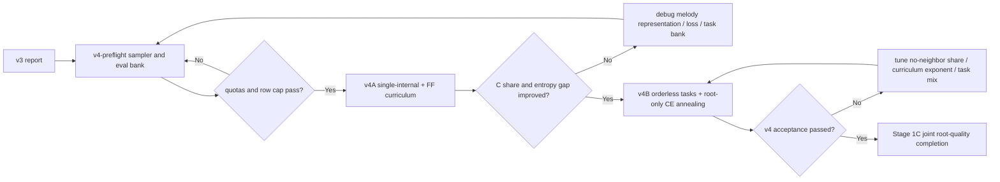

# Stage 1A v4 Training Plan

生成时间：2026-08-11  
阶段：Stage 1A, Root / Chord Masked Completion  
目标版本：v4

## 1. 目标结论

v4 的目标不是扩大 v3 的训练步数，也不是马上改成真正的 encoder-only 架构。v4 要验证一个更窄的问题：

```text
当邻居 root 这个 shortcut 被训练课程控制住以后，模型是否更依赖 melody 来预测 masked root？
```

v3 已经证明训练链路有效，但同时暴露了三个问题：

| 问题 | v3 证据 | v4 对策 |
|---|---:|---|
| `<R_C>` 预测过多 | balanced pred `<R_C>` share 33.61%，gold 8.34% | 渐进隐藏/解锁邻居 root，保留 no-neighbor-root 子集。 |
| context 分布不均衡 | `cadential_center` 目标 20%，实际 39.97% | 先长度过滤，再 post-filter quota。 |
| 样本复用过高 | 12000 examples 来自 1499 unique rows，单 row 最多 289 次 | 给 row 使用次数加硬上限。 |

v4 的核心判断标准：

```text
不是只看 root accuracy 是否涨，
而是同时看 pred/gold entropy gap、pred <R_C> share、no-neighbor-root vs full-context accuracy gap。
```

## 2. 最新研究对齐时间线

只列对当前项目有直接工程价值的点。

| 时间 | 工作 | 关键特点 | 对我们的影响 |
|---|---|---|---|
| 2021 | Sun et al., Orderless NADE / chord balancing | 用 class weighting 缓解和弦类别边际分布不均；orderless 训练不固定哪个字段永远可见。 | 我们已经做采样侧 root balance，但还应打破 quality 永远可见、root 永远被遮的固定模式。 |
| 2021 | SurpriseNet | 报告加权 balancing 可能带来新的和弦分布偏置。 | root-only CE 不应从第一步就开到最大，应退火。 |
| 2025-08 | Diffusion-inspired masked melodic harmonization | encoder-only masked LM，证明非自回归 masked harmonization 是可行路线。 | Stage 1A 的 masked completion 方向继续保留。 |
| 2025-09 | HarmonyTok | 比较 ChordSymbol / RootType / PitchClass / RootPC，结论是没有单一最优 tokenization。 | Stage 1A 继续用 root / quality 拆分，便于 balance、诊断和辅助任务。 |
| 2025-12 | B* constraint decoding | AR 模型上用 beam search + A* + backtracking 满足用户指定和弦约束。 | 暂不进入 v4；以后做“用户锁定某些和弦”时再考虑。 |
| 2026 | Encoder-only PMLR 303 | SE/DE 对照，single encoder 强；推理时最低熵优先 `certain` 最好。 | 先改 mask/curriculum/诊断，不急着做双 encoder 或新 head。 |
| 2026 | FF curriculum paper | 诊断 weak melody-harmony attention；先全 mask，再逐渐 unmask。 | v4 的最高优先级：邻居 root 渐进解锁。 |

参考来源：

- [PMLR 303 Encoder-only melodic harmonization](https://proceedings.mlr.press/v303/kaliakatsos-papakostas26a.html)
- [Pay (Cross) Attention to the Melody: Curriculum Masking](https://arxiv.org/abs/2601.16150)
- [Sun et al. Orderless NADE](https://arxiv.org/abs/2010.13468)
- [SurpriseNet, ISMIR 2021](https://archives.ismir.net/ismir2021/paper/000012.pdf)
- [B* constrained harmonization](https://arxiv.org/abs/2512.07627)

## 3. v4 路线决策

### 3.1 模型范式

短期采用：

```text
Qwen3 causal LM + masked-infilling-style SFT
```

不在 v4 切换到真正 encoder-only。原因：

| 选项 | v4 决策 | 原因 |
|---|---|---|
| 真正 encoder-only / BERT-style MLM | 暂不做 | 需要换模型、attention mask、loss、推理方式和 checkpoint 路线，改动过大。 |
| 继续 Qwen causal LM | 保留 | 当前链路已验证可训练，适合先验证 curriculum 假设。 |
| 双 encoder / cross-attention | 暂不做 | 最新结果支持先控制输入可见性；Qwen 没有独立 melody/harmony 通路。 |
| 新增 root/quality 专用输出头 | 不做 | 违背当前“同一个 LM head、只在 loss 端约束”的简洁路线。 |

因此 v4 的“对齐 encoder-only 最新成果”不是架构手术，而是对齐其任务思想：

```text
给定 melody + masked harmony context，控制可见 context，再恢复 masked harmony 字段。
```

### 3.2 Tokenization

v4 继续使用 root / quality 拆分：

```text
<R_C> <Q_MAJ7>
<R_G> <Q_DOM7>
<R_A> <Q_MIN7>
```

原因：

| 方案 | v4 结论 | 原因 |
|---|---|---|
| RootType，即 root / quality 拆分 | 继续使用 | 便于 root balance、root-only CE、quality mask、both mask 和错误归因。 |
| ChordSymbol 整和弦 token | 暂不切换 | 更短，但 root 与 quality 错误混在一起，不利于 Stage 1A 诊断。 |
| PitchClass tokenization | 暂不切换 | 更细，但会把 chord 拆成多个音级 token，训练和评估复杂度上升。 |

v4 的问题不是 token 表达能力不足，而是模型利用了 visible context shortcut。因此 tokenization 暂不作为主要变量。

### 3.3 B* / A*

B* 和 A* 不进入 v4。

A* 是搜索算法，用“已走成本 + 未来估计成本”决定优先探索哪条路径。B* 是同组 AR 论文里的约束解码算法，组合了：

```text
beam search + A* + backtracking
```

它解决的是：

```text
用户指定某个位置必须出现某个和弦，AR 解码必须满足这个约束。
```

Stage 1A v4 当前解决的是 root 判别和 context shortcut，不涉及用户硬约束解码。

## 4. FF Curriculum 设计

### 4.1 公式

采用 FF curriculum 的核心公式：

```math
v(s)=\left(\frac{s}{s_{\mathrm{total}}}\right)^5
```

```math
\#\mathrm{visibleNeighborRoots}
=
\min(\lfloor v(s)\cdot L\rfloor,\ L-1)
```

其中：

| 符号 | 含义 |
|---|---|
| \(s\) | 当前 optimizer step。 |
| \(s_{\mathrm{total}}\) | 本次训练计划总 optimizer steps。 |
| \(L\) | 当前样本里可被显示的非目标 root 槽位数。 |
| \(v(s)\) | 当前训练进度下邻居 root 可见比例。 |

方向必须明确：

```text
P(邻居 root 可见) = v(s)
P(邻居 root 隐藏) = 1 - v(s)
```

不要写反。

### 4.2 v4 输入规则

课程只作用于邻居 root：

| 字段 | v4 规则 |
|---|---|
| target root | 永远是 `<MASK_ROOT>`。 |
| neighbor root | 按 FF curriculum 从 `<ROOT_HIDDEN>` 逐步恢复为真实 `<R_...>`。 |
| quality | 默认始终可见；orderless 辅助任务中可被 mask。 |
| span boundary | 始终可见。 |
| melody | 始终可见。 |

需要新增或确认的 token：

```text
<ROOT_HIDDEN>
<QUALITY_HIDDEN>
```

如果已有 `<MASK_ROOT>` / `<MASK_QUALITY>` 只表示预测目标，则建议用 `<ROOT_HIDDEN>` / `<QUALITY_HIDDEN>` 表示“非目标字段被隐藏”，避免模型把所有 mask 都理解为要输出答案。

### 4.3 为什么这样设计

v3 的旁路是：

```text
neighbor root -> current root
```

v4 希望训练前半程强制模型更多走主路：

```text
melody + quality + span boundary -> current root
```

训练后期再逐渐恢复邻居 root，让模型学习合理利用上下文，而不是从一开始就依赖上下文。

## 5. v4 实验顺序

不要一次性把全部改动混在一起。v4 分三步。

### 5.1 v4-preflight：采样器和验证集预检

不训练模型，只生成 task bank 和 eval bank。

必须通过：

| 检查项 | 目标 |
|---|---|
| root label count | 12 个 root 在训练目标中严格均衡，或报告明确偏差。 |
| post-filter mask quota | 长度过滤后再做 quota，最终比例接近目标。 |
| context type quota | `full_visible` / `ff_curriculum` / `no_neighbor_root` 可单独统计。 |
| row reuse cap | 单 row 全程最多 30-50 次，推荐先取 40。 |
| skipped overlength | 按 mask type 统计，防止某一类被系统性过滤。 |
| eval bank 固定 | 同一套 checkpoint 使用同一套 eval jsonl。 |

v4-preflight 产物建议：

```text
outputs/stage1a-v4-preflight/task_bank_stats.json
outputs/stage1a-v4-preflight/eval_bank_stats.json
outputs/stage1a-v4-preflight/sample_examples.jsonl
```

### 5.2 v4A：FF curriculum 控制实验

目的：单独验证“渐进解锁邻居 root”是否能压低 `<R_C>` shortcut。

只做以下改动：

| 项目 | v4A 设置 |
|---|---|
| mask type | 只用 `single_internal`。 |
| root balance | 每个 root 每个 update 尽量 1 条。 |
| neighbor root | 使用 FF curriculum 渐进可见。 |
| no-neighbor-root 固定子集 | 保留 15%-20%，推荐 20%。 |
| quality | 始终可见。 |
| orderless quality mask | 不开。 |
| mask both | 不开。 |
| root-only CE | 不开。 |
| 模型架构 | 不变，Qwen causal LM。 |

推荐 checkpoint：

```text
1000 / 3000 / 5000 optimizer updates
```

v4A 关键判断：

| 指标 | 期望变化 |
|---|---|
| balanced pred `<R_C>` share | 明显低于 v3 的 33.61%。 |
| natural pred `<R_C>` share | 明显低于 v3 的 44.75%。 |
| pred/gold entropy gap | 小于 v3 balanced gap 0.41、natural gap 0.50。 |
| no-neighbor-root accuracy | 不应塌到随机附近；若明显低于 full context，说明旁路依赖仍强。 |
| single-internal eval macro acc | 高于 v3 同类表现，并且 per-root 不出现大面积 dead root。 |

如果 v4A 不能压低 `<R_C>` share，不进入 v4B，先排查：

```text
melody 表示是否信息不足
answer token loss 是否仍被 full-vocab CE 稀释
root candidate bank 是否仍有 context 偏差
```

### 5.3 v4B：完整 v4 训练

只有 v4A 有效后再跑。

v4B 增加 orderless 辅助任务和 root-only CE 退火：

| 任务类型 | 建议占比 | 输入 | 输出 | 是否计入 root accuracy 验收 |
|---|---:|---|---|---:|
| root mask, FF neighbor curriculum | 55%-65% | target root mask，quality 可见，neighbor root 渐进可见 | root | 是 |
| permanent no-neighbor-root | 15%-20% | target root mask，所有 neighbor root hidden，quality 可见 | root | 是，且单独分层 |
| mask quality, reveal root | 10%-15% | target quality mask，target root 可见 | quality | 否，辅助任务 |
| mask both | 10%-15% | target root 和 quality 都 mask | root + quality | root 部分可单独报告，但不作为主验收 |

v4B 推荐先取：

```text
root FF: 60%
permanent no-neighbor-root: 20%
mask quality: 10%
mask both: 10%
```

root-only CE 退火：

```text
0% - 25% steps: lambda_R = 0
25% - 50% steps: lambda_R linearly increases from 0 to 1
50% - 100% steps: lambda_R = 1
```

总 loss：

```math
\mathcal{L}
=
\mathcal{L}_{\mathrm{LM}}
+
\lambda_R(s)\mathcal{L}_{\mathrm{rootOnly}}
```

root-only CE 只在 root target 位置生效：

```math
\mathcal{L}_{\mathrm{rootOnly}}
=
-\log
\frac{\exp z_{r_i}}
{\sum_{r'\in\mathcal{R}}\exp z_{r'}}
```

不新增分类 head，不改变答案格式。

## 6. 固定 Eval Sets

v4 必须固定 eval bank，所有 checkpoint 用同一套。

| Eval set | 建议规模 | 目的 |
|---|---:|---|
| balanced root eval | 每 root 200-500 | 看 12 类 root 是否都学会。 |
| natural full eval | 至少 5000 或全量 | 看真实分布场景。 |
| single-internal eval | 每 root 200 | 对齐 v4A 主任务。 |
| full-visible-context eval | 每 root 200 | 看有邻居 root 时的上限表现。 |
| no-neighbor-root eval | 每 root 200 | 看 melody + quality + span 是否足够。 |
| cadence eval | 每 root 200 | 单独看 cadential shortcut 是否仍诱导 C/G/F。 |
| mask-quality eval | 每 quality 100-200 | 只用于 v4B 辅助任务健康度。 |
| mask-both eval | 每 root 100-200 | 看完全无 target chord 字段时的性能。 |

每个 eval set 都要输出：

| 指标 | 说明 |
|---|---|
| micro root accuracy | 总体 root top-1。 |
| macro root accuracy | 12 root 平均，防止 C/G/F 掩盖弱类。 |
| top-3 root accuracy | 看候选排序是否变好。 |
| min per-root accuracy | 找 dead root。 |
| gold root share | gold 分布。 |
| pred root share | 预测分布。 |
| gold entropy / pred entropy / gap | 预测是否过尖。 |
| accuracy by context type | full vs no-neighbor-root vs FF。 |
| accuracy by mask type | single / cadence / double / sparse / both。 |
| accuracy by quality | 找 quality shortcut。 |
| accuracy by dataset | EMOPIA+ / POP909 / HLSD。 |
| row reuse stats | eval 是否被少量 row 支配。 |

## 7. v4 验收标准

进入 Stage 1C 前，建议最低满足：

| 指标 | v3 值 | v4 最低目标 |
|---|---:|---:|
| balanced macro accuracy | 17.05% | 25%-35%，且稳定高于 v3。 |
| natural accuracy | 22.43% | 至少高于 always-C baseline 5 pp。 |
| balanced pred `<R_C>` share | 33.61% | 尽量低于 20%，至少低于 25%。 |
| natural pred `<R_C>` share | 44.75% | 尽量接近 gold，至少低于 35%。 |
| balanced entropy gap | 0.41 | 明显下降，目标先看 < 0.25。 |
| natural entropy gap | 0.50 | 明显下降，目标先看 < 0.30。 |
| min per-root accuracy | 2.00% | 不为 0，且至少 8/12 roots 明显高于随机噪声。 |
| balanced top-3 accuracy | 46.04% | 55%-60% 起步。 |

context 分层验收：

| 对比 | 解释 | 决策 |
|---|---|---|
| no-neighbor-root accuracy 远低于 full-visible | 模型仍依赖邻居 root 旁路。 | 增大 permanent no-neighbor-root 占比，或延长低 \(v\) 阶段。 |
| no-neighbor-root 接近 full-visible，但总体仍低 | 旁路不是主瓶颈。 | 排查 melody 表示、span 粒度、loss 或数据质量。 |
| full-visible 高、no-neighbor-root 低、`<R_C>` share 高 | 典型 context shortcut。 | 保留 FF，不进入 Stage 1C。 |
| entropy gap 下降但 accuracy 不升 | 分布更健康但判别力不足。 | 考虑 root-only CE 退火、更多样本或更长训练。 |

## 8. 实施清单

### 数据和采样

- [ ] 新增 `<ROOT_HIDDEN>`，必要时新增 `<QUALITY_HIDDEN>`。
- [ ] 先做 max length filtering，再执行 mask type quota。
- [ ] 给 `_choose_diverse_task` 或 v4 sampler 加 row reuse cap，推荐 40。
- [ ] 保存每条 task 的 `row_id`、`song_id`、`dataset`、`target_root`、`quality`、`mask_type`、`context_type`、`visible_neighbor_root_count`、`curriculum_v`。
- [ ] 固定 eval bank 到 jsonl，训练过程不要动态重采 eval。

### 训练

- [ ] v4A：只开 single-internal + FF curriculum + 20% permanent no-neighbor-root。
- [ ] v4A：不开 orderless，不开 root-only CE。
- [ ] v4B：加入 quality mask / both mask。
- [ ] v4B：root-only CE 使用退火，不新增 head。
- [ ] 每个 checkpoint 保存 sampler stats 和 eval metrics。

### 诊断

- [ ] 报告 pred/gold entropy gap。
- [ ] 报告 no-neighbor-root vs full-visible accuracy。
- [ ] 报告 `<R_C>` share、top-3、macro、min per-root。
- [ ] 报告 mask type、quality、dataset 分层。
- [ ] 报告 row reuse 分布和 max row reuse。

## 9. 暂不做事项

| 不做 | 原因 |
|---|---|
| 直接进入 Stage 2 | v3 natural 只比 always-C baseline 高约 0.86 pp，root 判别不稳。 |
| 真正 encoder-only 重构 | v4 先验证 curriculum，避免同时改变架构和数据。 |
| 双 encoder / cross-attention 架构 | Qwen causal LM 没有独立通路；当前问题优先在输入可见性层面解决。 |
| root/quality 专用输出头 | 先保持 LM head 路线，root-only CE 只在 loss 端约束。 |
| B* / A* 约束解码 | 当前不是用户硬约束生成阶段。 |
| PitchClass tokenization | 当前问题不是 chord token 表达不足。 |

## 10. 推荐执行顺序



简短决策：

```text
v4A 是假设检验：FF curriculum 是否能抑制邻居 root shortcut。
v4B 是完整 recipe：在 FF 有效后再叠加 orderless 与 root-only CE 退火。
Stage 1C 必须等 v4 root 预测分布健康后再开始。
```
